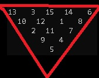

# The Pyramid Math Riddle



You must subtract using absolute values in the results going from top to bottom. You may use each number only once. You are allowed
numbers 1 thru the summation of each level of the pyramid.

For example:

```
2lvl pyramid  3 - 2          (allowed #'s 1 to 3)
          =  1


3lvl pyramid 6 - 1 - 4       (allowed #'s 1 to 6)
         =  5 - 3
          =   2

4lvl pyramid 6 - 10 - 1 - 8  (allowed #'s 1 to 10)
         =  4 - 9 - 7
          =   5 - 2
            =   3

```            

# Code
This puzzle is solved using Z3 and a short article about it can be found [here](http://lallouslab.net/2020/05/12/the-inverted-pyramid-puzzle/).

The Python solution with Z3 is found [here](InvertedPyramid.py) and the original C++ solution can be found [here](other/pyramid.cpp).